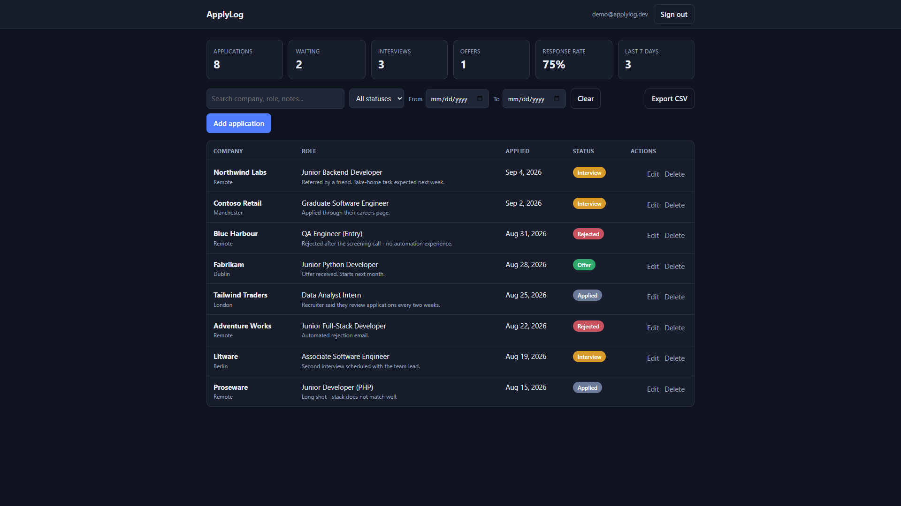

# ApplyLog

I built this because a spreadsheet falls apart after ~30 applications. You log each
one, move it through statuses, filter the list, and see if you're actually getting
replies.

FastAPI + Postgres, a plain JS frontend, 26 API tests and 9 Playwright tests in
GitHub Actions.

## Live demo

**[[https://applylog-v0lm.onrender.com/](https://applylog-v0lm.onrender.com/)](https://applylog-or59.onrender.com/)**

It's on Render's free tier, so the first hit after idle can take 30–60 seconds while
the app wakes up. The database is Neon; that part comes back almost immediately.
Sign up with any email — accounts only exist in this app.



## What it does

- Email + password accounts (PBKDF2, session cookie)
- Add / edit / delete applications
- Filter by status or date, search company / role / location / notes
- Stats: totals, response rate, offer rate, last 7 days
- CSV export of whatever the current filters are
- Queries are scoped to the signed-in user

## Run it locally

```bash
docker compose up -d            # Postgres on port 5433

python -m venv .venv
.venv\Scripts\activate          # macOS/Linux: source .venv/bin/activate
pip install -r requirements-dev.txt

python -c "import secrets; print(secrets.token_hex(32))"   # put this in APPLYLOG_SECRET_KEY
uvicorn app.main:app --reload
```

Then open http://127.0.0.1:8000 and make an account. API docs are at
http://127.0.0.1:8000/docs. Migrations in [migrations/](migrations/) run on startup.

Env vars are in [.env.example](.env.example). The default `APPLYLOG_DATABASE_URL`
matches [docker-compose.yml](docker-compose.yml), so tests work without extra setup.
If you skip `APPLYLOG_SECRET_KEY`, the app invents one at startup — sessions work,
but everyone gets logged out on restart.

On Windows with Smart App Control on, psycopg's bundled `libpq` DLL gets blocked.
Install the PostgreSQL client tools so a signed `libpq` is on `PATH`; psycopg then
falls back to pure Python. Linux (CI, Render) uses the binary wheel.

### Demo data

```bash
python scripts/seed_demo.py --email you@example.com --reset
```

Sign up in the app first — the script doesn't create accounts.

## Tests

```bash
docker compose up -d        # both suites need Postgres
pytest                      # 26 API tests, ~3 seconds
playwright install chromium # once
pytest tests_e2e            # 9 browser tests
```

Each suite has its own database (`applylog_test` and `applylog_e2e`), so they
don't step on each other or your local data.

API tests cover auth, validation, filters, search, stats, CSV, and that one user
can't see another user's rows. Browser tests in [tests_e2e/](tests_e2e/) click
through the actual UI against a throwaway server.

## Deploying

The demo is a free Render web service using the [Procfile](Procfile). Wherever you
host it, set:

- `APPLYLOG_SECRET_KEY` to a fixed random value (otherwise sessions die on restart)
- `APPLYLOG_HTTPS_ONLY=1` so the cookie is `Secure`
- `APPLYLOG_DATABASE_URL` to a pooled Postgres URL

I started with SQLite. That was fine locally and useless on Render — free instances
wipe the filesystem on every deploy and idle spin-down. Neon doesn't expire on the
free plan, so the data actually survives. [render.yaml](render.yaml) is the
Blueprint; no paid plan or disk.

I skipped an ORM (two tables, SQL is readable) and a frontend framework (one page
of DOM updates). Passwords use stdlib PBKDF2 so you don't need a native wheel.

## Maybe later

- Reminders when something's been sitting with no reply
- Status-change history
- Pagination if the list gets huge
