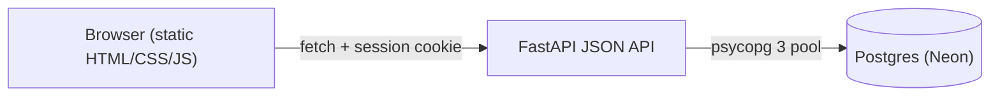

# ApplyLog

A job application tracker I built because a spreadsheet stops being useful once you
have applied to 30+ jobs. Log each application, move it through statuses, filter the
list, and see whether the effort is actually producing replies.

FastAPI + Postgres backend, vanilla JavaScript frontend, 26 API tests and 9 Playwright
browser tests, both running in GitHub Actions.

## Live demo

**[https://applylog-v0lm.onrender.com/](https://applylog-or59.onrender.com/)**

Hosted on Render's free tier, so the first request after a quiet period takes 30 to 60
seconds while the service wakes up. The database is Neon, which suspends after five
minutes idle but resumes in well under a second, so it is not the part you are waiting
for. Sign up with any email to try it; accounts only exist inside this app.


## Features

- Email + password accounts; passwords hashed with PBKDF2-HMAC-SHA256, sessions in a signed cookie
- Create, edit and delete applications (company, role, link, location, notes, status, applied date)
- Filter by status and applied-date range, plus full-text search across company, role, location and notes
- Summary stats: totals per status, response rate, offer rate, applications in the last 7 days
- CSV export that respects the filters currently applied
- Every query is scoped to the signed-in user, so accounts cannot see each other's data

## Run it locally

```bash
docker compose up -d            # Postgres on port 5433

python -m venv .venv
.venv\Scripts\activate          # macOS/Linux: source .venv/bin/activate
pip install -r requirements-dev.txt

python -c "import secrets; print(secrets.token_hex(32))"   # put this in APPLYLOG_SECRET_KEY
uvicorn app.main:app --reload
```

Open http://127.0.0.1:8000, create an account, and start logging applications.
Interactive API docs are at http://127.0.0.1:8000/docs. Migrations in
[migrations/](migrations/) are applied automatically on startup.

Configuration is environment-based; see [.env.example](.env.example). The default
`APPLYLOG_DATABASE_URL` matches [docker-compose.yml](docker-compose.yml), so a fresh
clone needs no configuration to run the tests. Without `APPLYLOG_SECRET_KEY` the app
generates a random key at startup, which signs sessions fine but logs everyone out on
restart.

On Windows with Smart App Control enabled, psycopg's bundled `libpq` DLL is blocked
from loading. Installing the PostgreSQL client tools puts a signed `libpq` on `PATH`
and psycopg falls back to its pure-Python implementation. Linux, and therefore CI and
Render, use the binary wheel as normal.

### Demo data

To fill an account with sample applications for a screenshot or a demo:

```bash
python scripts/seed_demo.py --email you@example.com --reset
```

## Tests

```bash
docker compose up -d        # both suites need Postgres running
pytest                      # 26 API tests, ~3 seconds
playwright install chromium # once
pytest tests_e2e            # 9 browser tests against a real server
```

Each suite creates and migrates its own database (`applylog_test` and `applylog_e2e`),
so they never disturb each other or your development data.

The API tests cover registration and login, session handling, validation, filtering and
search, the stats maths, CSV export, and the ownership rules that keep one user out of
another user's records.

The browser tests in [tests_e2e/](tests_e2e/) drive Chromium through the flows a user
clicks: sign up, add, filter, search, edit, delete (including cancelling the confirm
dialog), downloading the CSV, and signing out. They start their own server on a random
free port against a throwaway database, so they never touch your real data. They are
also the tests that caught the commit-ordering bug described below, which the API tests
could not see.

## How it fits together



| Path | Purpose |
| --- | --- |
| [app/main.py](app/main.py) | App setup, session middleware, static files |
| [app/routers/auth.py](app/routers/auth.py) | Register, login, logout, current user |
| [app/routers/applications.py](app/routers/applications.py) | CRUD, filters, stats, CSV export |
| [app/db.py](app/db.py) | Connection pool and migration runner |
| [migrations/](migrations/) | Numbered SQL migrations, applied in filename order |
| [app/security.py](app/security.py) | Password hashing and verification |
| [app/static/](app/static/) | Frontend: one page, no build step |
| [tests/](tests/) | API tests |
| [tests_e2e/](tests_e2e/) | Playwright browser tests |

## Deploying

The live demo runs as a free Render web service built from this repo, using the
[Procfile](Procfile) start command. Two settings matter wherever you host it:

- Set `APPLYLOG_SECRET_KEY` to a fixed random value, so sessions survive a restart.
- Set `APPLYLOG_HTTPS_ONLY=1` so the session cookie is marked `Secure`.
- Set `APPLYLOG_DATABASE_URL` to a pooled Postgres connection string.

The database is Neon rather than anything hosted on Render. Free Render services have
an ephemeral filesystem and cannot attach a disk, so the SQLite file this project
started with was wiped on every redeploy, restart and idle spin-down - a demo that
quietly lost your data between visits. Render's own free Postgres expires after a fixed
window, which has the same ending. Neon's free plan does not expire, needs no card, and
separates storage from compute, so an idle database costs nothing and the data outlives
every deploy.

[render.yaml](render.yaml) describes the deployment as a Blueprint. It no longer needs
a paid plan or a disk.

## Decisions and trade-offs

- **Postgres instead of SQLite.** The original SQLite file was the right call for a
  local tracker and the wrong one for a hosted demo, because free hosts do not keep a
  filesystem. The migration touched three files, and the existing API tests are the only
  reason it took an afternoon: they pinned down case-insensitive email uniqueness,
  literal `%` in search, and the per-user ownership rules while the storage layer
  changed underneath them.
- **No ORM, still.** The data model is two tables; psycopg 3 with `dict_row` keeps the
  SQL visible and the dependency list short. Schema changes are numbered `.sql` files
  applied on startup, which is less machinery than Alembic for a project this size.
- **Autocommit, with explicit transactions where they matter.** FastAPI closes a `yield`
  dependency *after* the response has been sent, so committing there let the browser's
  next request arrive before the write had landed. Registration returned 201, the
  follow-up call found no such user, and the session was cleared - a sign-up that
  immediately signed you out. SQLite was fast enough to hide it; Postgres was not. Each
  statement now commits on its own, and mutations use `RETURNING` so a write and the row
  it returns are one atomic statement rather than a check followed by an update.
- **Case-insensitive email via a unique index on `lower(email)`.** SQLite got this from
  `COLLATE NOCASE`, which has no direct Postgres equivalent on a plain column. The
  functional index enforces it and every lookup goes through `lower(email)` to use it,
  which avoids depending on the `citext` extension.
- **Session cookie instead of JWT.** The frontend is served from the same origin, so a
  signed `HttpOnly` cookie avoids storing tokens in JavaScript.
- **No frontend framework.** The UI is one page of DOM updates. A build step would add
  more setup than it saves at this size.
- **PBKDF2 from the standard library** rather than bcrypt or argon2, so the project
  installs cleanly on any machine without compiling native wheels.

## Things I would add next

- Reminders for applications with no reply after N days
- A status-change history so the funnel can be charted over time
- Pagination once the list grows past a few hundred rows

## At a glance

> **ApplyLog** - job application tracker (Python, FastAPI, Postgres, vanilla JS).
> Live: https://applylog-v0lm.onrender.com/
> Auth with hashed passwords, CRUD with search and date filters, response-rate stats,
> CSV export. 26 pytest API tests and 9 Playwright browser tests running against a
> Postgres service container in GitHub Actions.
